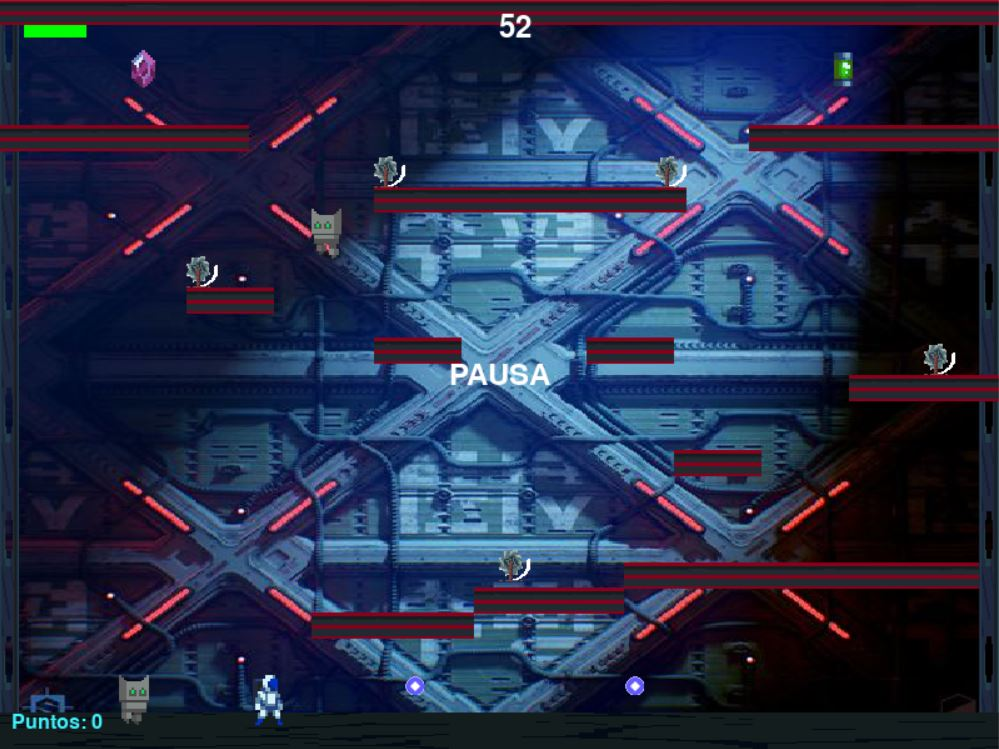
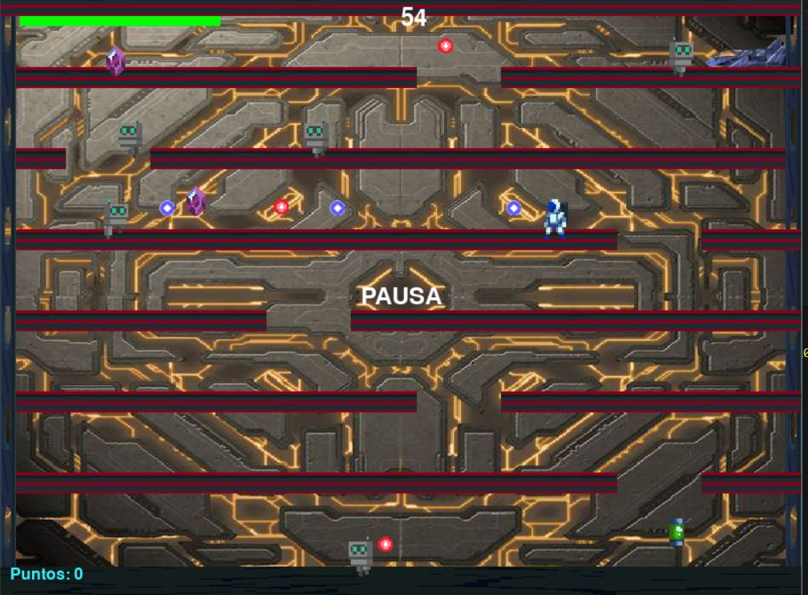
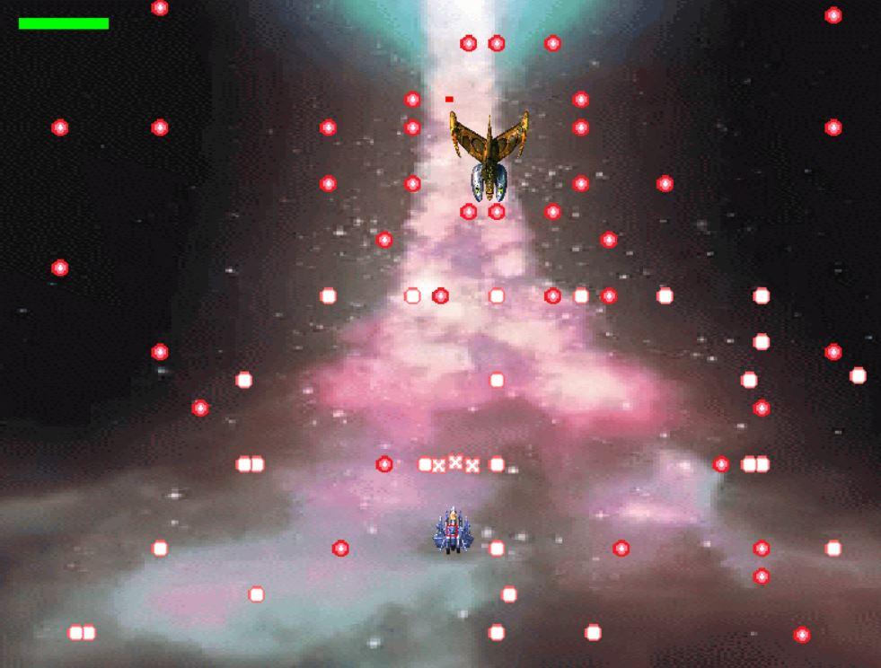

# Blue Oddity

## Descripción

Este proyecto es mi primer videojuego. Fue el examen para la materia Programación 1 en mi carrera universitaria. 

El juego consta de tres niveles y dos etapas.
1er etapa: Son los primeros dos niveles, los cuales tienen un gameplay de tipo plataformer y en estos deben recoletarse todos los cristales (puntos) que se puedan en 60 segundos, mientras se van sobreviviendo a los robots (enemigos) los cuales seran o kamikazes en busca de nuestra vida o nos atacaran con proyectiles.

2da etapa: Esta seria la pelea contra el jefe (Xibanulip), el cual presenta un gameplay tipo bullethell (shmup) y seria una batalla de naves en el espacio.

## Tecnologías Utilizadas

- Python
- Pygame

## Capturas de Pantalla


*Pantalla de menú*


*Pelea Final*

## Niveles

### Nivel 1: Plataformas


Los enemigos son robots kamikaze.

### Nivel 2: Plataformas



Los enemigos ahora disparan.

### Nivel 3: Batalla de Naves Bullet Hell



Batalla bullet hell contra el jefe.

## Instrucciones de Ejecución

1. Clona el repositorio.
2. Instala las dependencias (si es necesario).
3. Ejecuta el main.

## Código Destacado

```python
    #Uno de los metodos de la clase proyectil, para generar un patron con una dirección.
    def triple_linea(self, proyectil_cont, x_e, y_e, speed, x, y):
        angulo = self.obtener_angulo(x_e,y_e ,x, y )
        for _ in range(8):
            disparo = Proyectil((15, 15), (x_e, y_e + 10), "img/129.png", 90, speed, -angulo)
            proyectil_cont.append(disparo)
            disparo = Proyectil((15, 15), (x_e, y_e + 10), "img/129.png", 90, speed, -angulo+40)
            proyectil_cont.append(disparo)
            disparo = Proyectil((15, 15), (x_e, y_e + 10), "img/129.png", 90, speed, -angulo-40)
            proyectil_cont.append(disparo)
            speed += 1