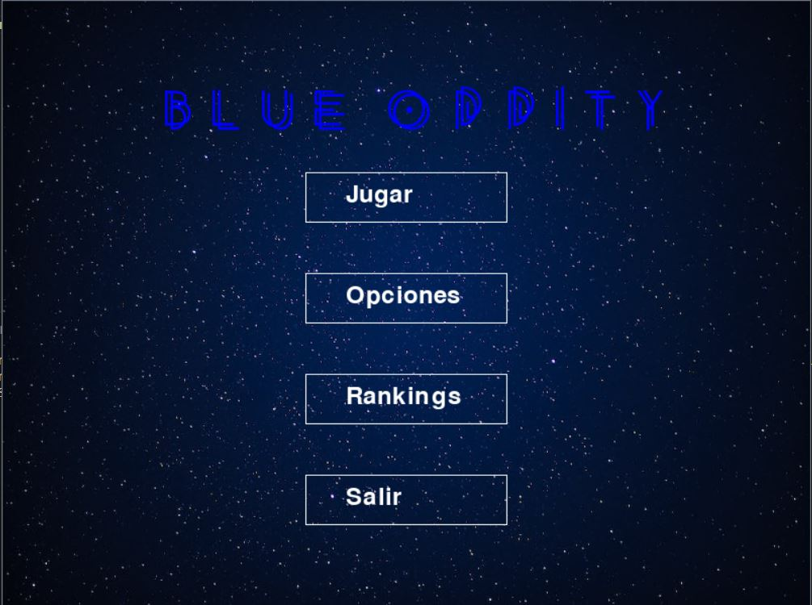
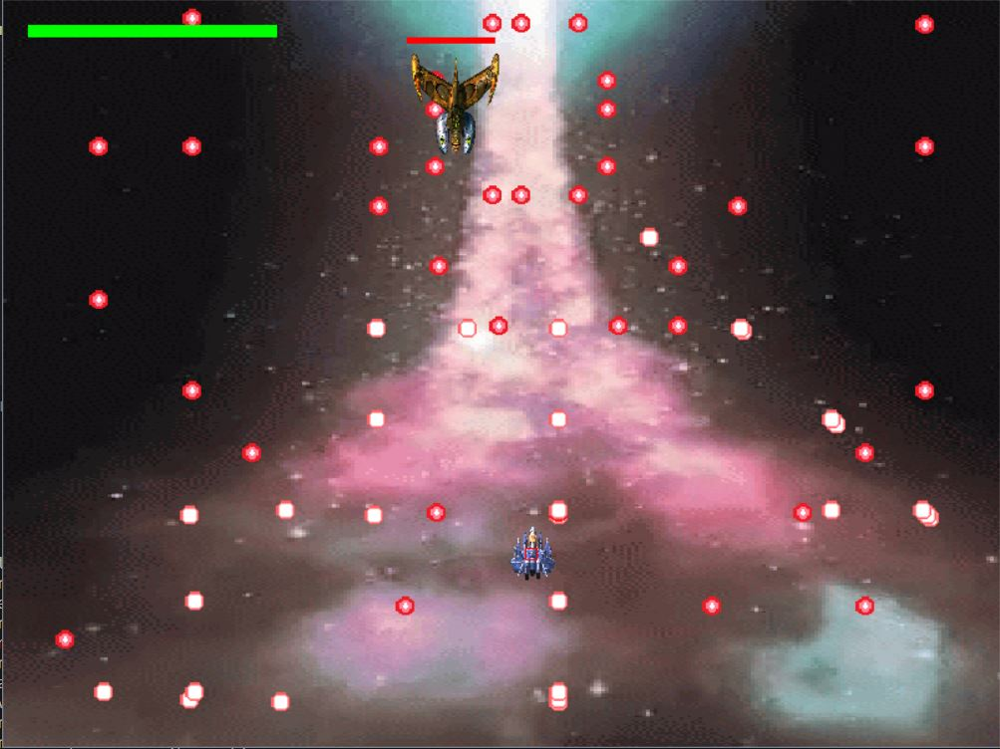

# Blue Oddity

## Descripción

Este proyecto es mi primer videojuego. Fue el examen para la materia Programación 1 en mi carrera universitaria. 

El juego consta de tres niveles y dos etapas.
1er etapa: Son los primeros dos niveles, los cuales tienen un gameplay de tipo plataformer y en estos deben recoletarse todos los cristales (puntos) que se puedan en 60 segundos, mientras se van sobreviviendo a los robots (enemigos) los cuales seran o kamikazes en busca de nuestra vida o nos atacaran con proyectiles.

2da etapa: Esta seria la pelea contra el jefe (Xibanulip), el cual presenta un gameplay tipo bullethell (shmup) y seria una batalla de naves en el espacio.

## Tecnologías Utilizadas

- Python
- Pygame

## Capturas de Pantalla


*Pantalla de menú*


*Pelea Final*

## Niveles

### Nivel 1: Plataformas


### Nivel 2: Plataformas

Breve descripción del segundo nivel de plataformas.

### Nivel 3: Batalla de Naves Bullet Hell

Breve descripción del tercer nivel de batalla de naves estilo bullet hell.

## Instrucciones de Ejecución

1. Clona el repositorio.
2. Instala las dependencias (si es necesario).
3. Ejecuta el juego.

## Código Destacado

```python
# Aquí puedes mostrar un fragmento de código destacado
# relacionado con el juego.